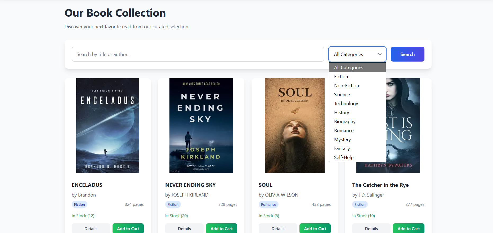
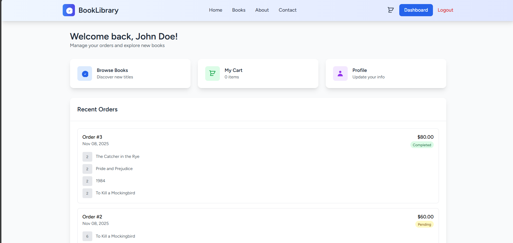
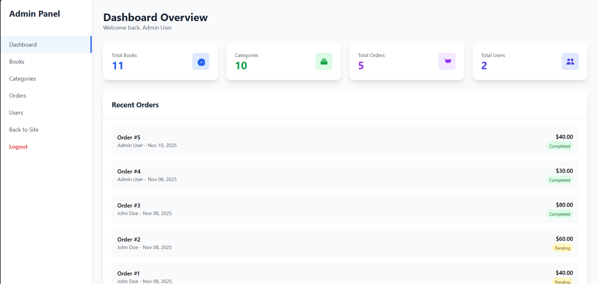
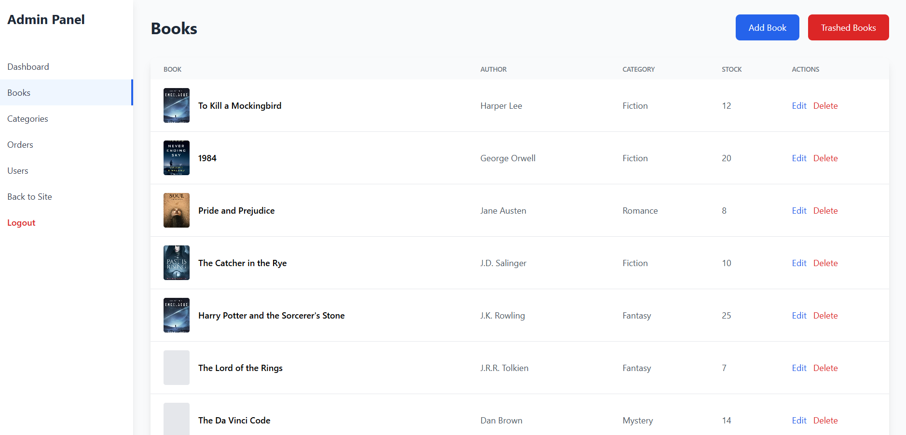
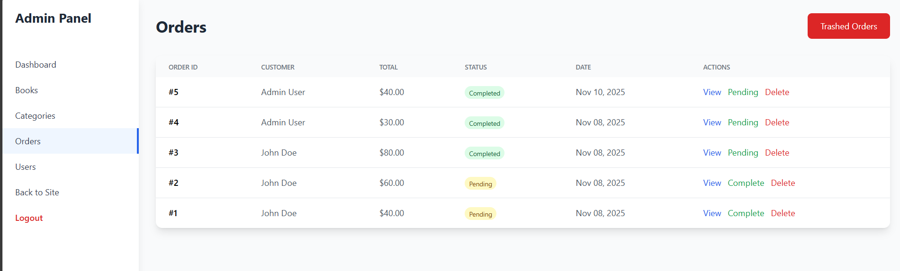

# TALLibrary 📚

A full-stack library management system built with the TALL stack (Tailwind CSS, Alpine.js, Laravel, Livewire).


## ✨ Highlights

- **Component-based UI with Livewire**  
  Modular and reactive components for seamless user experience

- **Realtime cart updates using Livewire events**  
  Instant feedback and dynamic cart interactions without page reloads

- **Role-based access control (Visitor, User, Admin)**  
  Secure and tailored access to features based on user roles

- **Clean, responsive UI with Tailwind CSS**  
  Mobile-first design with utility-first styling for fast development

- **Modular code structure for scalability**  
  Organized architecture that supports future growth and easy maintenance

---

## 📸 Screenshots

- **Homepage**  
  

- **Bookspage**  
  

- **User Dashboard**  
  

- **Cart View**  
  

- **Admin Panel**  
  

- **Admin Panel – Books Management**  
  

- **Admin Panel – Orders Management**  
  

---

## 👥 Roles & Features

### 🧭 Visitor
- Browse books and categories
- View book details

### 🙍‍♂️ User
- Register and log in
- Add books to cart
- Place orders
- View order history
- Edit profile

### 🛠️ Admin
- Manage books and categories
- Manage users and orders
- Access admin dashboard

---

## 🧰 Tech Stack

| Layer         | Technology        |
|---------------|-------------------|
| Styling       | Tailwind CSS      |
| Interactivity | Alpine.js         |
| Backend       | Laravel           |
| Components    | Livewire          |
| Database      | MySQL             |

---

## 🚀 Installation

```bash
git clone https://github.com/Kasemov123/TALLibrary.git
cd TALLibrary

composer install
npm install && npm run dev

cp .env.example .env
php artisan key:generate
php artisan migrate
```

Make sure to configure your `.env` file with correct database credentials 

## 📄 License  
This project is open-source and available under the MIT License.


## 🙌 Author  
Developed by **Kasem** – Full-Stack Developer specializing in the TALL stack.
